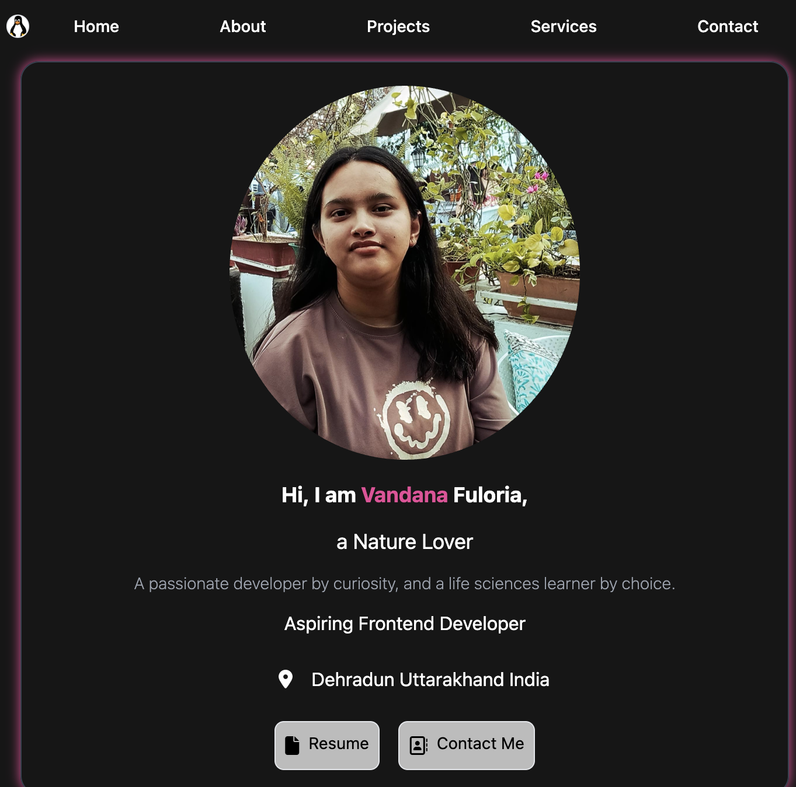

# Personal Portfolio – Vandana Fuloria

This is my personal developer portfolio built using React, Vite, and Tailwind CSS with a custom dark-only theme. It highlights my skills, technologies I've worked with, and both major and additional projects. The site includes a downloadable resume and LinkedIn contact link.

  

## Features

- Built with React (component-based architecture)

- Uses Vite for fast development and builds
- Styled with Tailwind CSS (dark theme only)
- Responsive design for all screen sizes
- Displays major and additional project sections
- Resume available for download/view
- Contact section with LinkedIn link
- Clean and modular code structure

## Sections

- Header
- Hero / Main Section

- About Me
- Technologies
- Projects
- Additional Projects
- Contact

## Tech Stack

- React
- Vite
- Tailwind CSS
- Font Awesome (for icons)

## Demo

### 👉 [Live Preview ]("my-portfolio-1iyl.vercel.app")

## Resume

Resume is included in the project under the `assets` folder and can be viewed or downloaded from the site via a button.

## Contact

- LinkedIn: [LinkedIn Profile](https://linkedin.com/in/vandanafuloria)
- Email: vandanafuloria@02gmail.com
